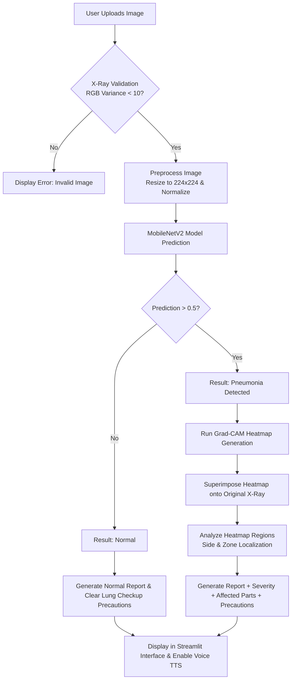

# 🫁 AI-Based Chest X-Ray Diagnosis System

[](https://www.python.org/)
[](https://streamlit.io/)
[](https://www.tensorflow.org/)
[](https://keras.io/)
[](https://opencv.org/)

An advanced, deep learning-powered medical imaging application that automatically detects **Pneumonia** from chest X-ray images. Built using **Transfer Learning (MobileNetV2)**, **Streamlit**, and **Explainable AI (Grad-CAM)** to assist medical professionals and screen cases rapidly.

---

## 📖 Table of Contents
- [🎯 Project Overview](#-project-overview)
- [✨ Key Features](#-key-features)
- [⚙️ How It Works (Architecture)](#%EF%B8%8F-how-it-works-architecture)
- [📂 Project Structure](#-project-structure)
- [🚀 Quick Start (Windows)](#-quick-start-windows)
- [🛠️ Manual Installation & Running](#%EF%B8%8F-manual-installation--running)
- [🧠 Model Training & Dataset](#-model-training--dataset)
- [📋 System Requirements](#-system-requirements)
- [⚠️ Medical Disclaimer](#%EF%B8%8F-medical-disclaimer)
- [🔮 Future Improvements](#-future-improvements)
- [📬 Contact & License](#-contact--license)

---

## 🎯 Project Overview
Pneumonia is an inflammatory lung infection that can become life-threatening if not diagnosed early. Reading chest X-rays manually requires specialized radiological expertise and time. 

This project automates the screening process using a high-precision neural network. Crucially, it addresses the "black box" problem of AI in healthcare by employing **Grad-CAM** (Gradient-weighted Class Activation Mapping). This feature highlights the precise areas of consolidation and infection in the lungs, giving clinicians visual evidence to trust and verify the AI's conclusions.

---

## ✨ Key Features

*   **⚡ Rapid Diagnosis**: Analyzes a chest X-ray image in under a second.
*   **🔥 Explainable AI (Grad-CAM Heatmap)**: Generates a jet-colored visual overlay highlighting regions that influenced the model's decision the most.
*   **🫁 Anatomical Localization**: Algorithmic intensity analysis of the heatmap to determine the affected lung side (**Left**, **Right**, or **Bilateral**) and depth zone (**Upper**, **Middle**, or **Lower**).
*   **🖼️ Smart X-Ray Validation**: Custom image validation logic that analyzes color channel deviations (RGB variance) to prevent users from uploading non-X-ray images.
*   **📄 Comprehensive AI Report**: Categorizes predictions into normal or pneumonia, displays confidence percentages, and estimates severity (Mild, Moderate, Severe).
*   **🔊 AI Voice Explanation**: Reads the report out loud using the browser's built-in Web Speech API (`SpeechSynthesis`) for better accessibility.
*   **🖥️ Premium User Interface**: Styled with custom CSS, containing responsive cards, progress bars, and tabbed interfaces.

---

## ⚙️ How It Works (Architecture)

The workflow of the application from user upload to diagnosis reporting is shown below:



---

## 📂 Project Structure

Below is the directory structure of the project:

```text
AI_Chest_Xray_Project/
│
├── dataset/                     # Chest X-Ray Datasets
│   ├── train/                   # Training split (used by train_model.py)
│   │   ├── NORMAL/              # Healthy chest X-ray images
│   │   └── PNEUMONIA/           # Pneumonia-infected chest X-ray images
│   ├── val/                     # Validation split
│   └── test/                    # Test split
│
├── model/                       # Serialized Deep Learning Models
│   └── chest_xray_model.h5      # Trained MobileNetV2 model
│
├── .venv/                       # Python virtual environment (auto-created)
├── app.py                       # Main Streamlit web application & UI
├── predict.py                   # Prediction, Grad-CAM, & localization logic
├── train_model.py               # Transfer learning & model training script
├── requirements.txt             # Project library dependencies
├── run_project.bat              # Setup & start script (Windows automated)
├── heatmap.jpg                  # Temporary generated overlay image
└── README.md                    # Project documentation
```

---

## 🚀 Quick Start (Windows)

If you are running on **Windows**, you don't need to manually configure virtual environments or install Python modules. We have provided a fully automated setup batch file:

1. Double-click the **`run_project.bat`** file.
2. The script will:
   - Search for a local Python installation (supports Python 3.10 and 3.11).
   - Clear any old or broken virtual environments.
   - Construct a clean virtual environment (`.venv`).
   - Upgrade `pip` and install all project dependencies from `requirements.txt`.
   - Boot up the Streamlit web application.
3. Once completed, a browser window will automatically launch at **`http://localhost:8501`**.

---

## 🛠️ Manual Installation & Running

If you prefer to set up the project manually (or on macOS/Linux), run the following commands:

### 1. Set Up Virtual Environment
```bash
# Create virtual environment
python -m venv .venv

# Activate virtual environment
# On Windows:
.venv\Scripts\activate
# On macOS/Linux:
source .venv/bin/activate
```

### 2. Install Dependencies
```bash
pip install --upgrade pip
pip install -r requirements.txt
```

### 3. Run the App
```bash
streamlit run app.py
```
Open **`http://localhost:8501`** in your browser.

---

## 🧠 Model Training & Dataset

The project uses transfer learning on a pre-trained **MobileNetV2** base architecture (with ImageNet weights). The base layers are frozen, and a custom classification head (`GlobalAveragePooling2D` -> `Dense` with `sigmoid` activation) is appended to predict a binary output (0 = Normal, 1 = Pneumonia).

### Training your own model:
1. Make sure you place your training images in `dataset/train/NORMAL` and `dataset/train/PNEUMONIA`.
2. Run the training script:
   ```bash
   python train_model.py
   ```
3. The script will train the model for 5 epochs using Adam optimizer and binary crossentropy loss.
4. The final model will be saved to `model/chest_xray_model.h5`.

---

## 📋 System Requirements

- **Operating System**: Windows 10/11, macOS, or Linux.
- **Python**: Version 3.10 or 3.11 is recommended.
- **Dependencies**: Listed in `requirements.txt`. Key versions include:
  - `tensorflow` (TensorFlow 2.x)
  - `streamlit`
  - `opencv-python`
  - `numpy`
  - `pillow`
  - `keras`

---

## ⚠️ Medical Disclaimer

> [!WARNING]
> This application is a **screening tool and educational demonstration**. It is **not** a certified medical device and does **not** provide official medical diagnoses. Predictions and heatmap outputs should always be reviewed by a qualified radiologist or physician. Do not use this tool for clinical decision-making.

---

## 🔮 Future Improvements

- [ ] **Multi-Disease Diagnostics**: Expand the model to classify additional lung pathologies like Tuberculosis, COVID-19, Atelectasis, and Pleural Effusion.
- [ ] **Transformer Architectures**: Experiment with Vision Transformers (ViTs) or newer CNNs for improved localization precision.
- [ ] **Cloud Hosting**: Deploy the system to cloud providers (Streamlit Community Cloud, AWS, or GCP) for global access.
- [ ] **API Service**: Expose the backend prediction framework via FastAPI to connect with mobile and tablet applications.

---

## 📬 Contact & License

- **Developer**: Akshay Saisree
- **Email**: [akshaysaisree5@gmail.com](mailto:akshaysaisree5@gmail.com)
- **GitHub**: [@akki864](https://github.com/akki864)

*Feel free to star this repository or open issues for questions/features!*
